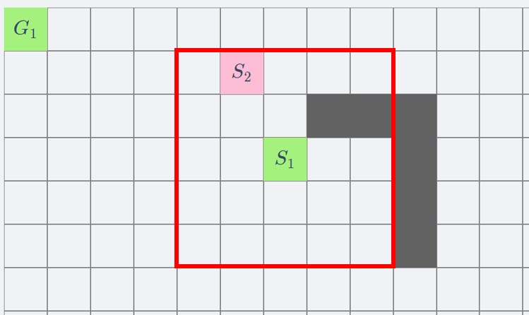

The baseline of this project is based on this [repository](https://github.com/proroklab/gnn_pathplanning).\
The scenario assumes local observation and distributed network, that is, each agent can only observe the world within a certain radius and can only communicate with other agents within this radius, and each agent makes motion decisions independently.\
Based on the above assumptions, the input structure of the network is shown below.\

For the agent S1, its observation is limited with the red box. Then, the first layer of the input is the position of the obstacles in the red box.